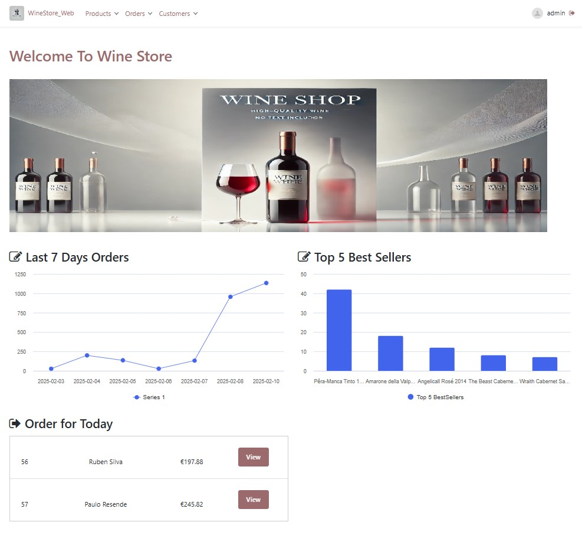

# E-Commerce Wine Store

This project was the final project of the 4-week OutSystems Bootcamp, where I learned how to expose and consume APIs within an OutSystems environment. The project is an E-Commerce Wine Store that utilizes wine data provided by an external API. This project was completed in under 10 days and was my first experience working with APIs as well as my first time developing mobile applications in OutSystems.

## Features

This project is divide in two main part: 

### 1. Web Application for Sellers

- **API Product Integration:** Sellers can select and add products from an external API to the store, importing the name, winery, category and the product image. 
- **Product Management:** View, edit, and add new products to the store.
- **Order Handling:** Monitor customer orders, review details, manage order, update order statuses, and cancel orders.
- **Customer Information Management:** Sellers can manage customers informations.
- **Automatic Email Notifications:** Automatically sends emails when an order is updated to shipped.

### 2. Mobile Application for Customers

- **User Registration:** New customers can register by filling out a form, and their data will be saved both in the app and store's backend.
- **Main Screen:** Displays a search bar and a carousel showing the top 5 best-selling products.
- **Search Functionality:** Customers can search products by name or category.
- **Easy Navigation:** The app includes top and bottom navigation bars for easy access to all screens.
- **Product Information:** Displays detailed information for each product, including the name, description, category, price, and image.
- **Shopping Cart:** Add products to the cart, remove items, and complete purchases.
- **Order History:** Users can view a complete history of their orders.

## Architecture

The project is structured into two main modules:
- **Front-end Module**: Responsible for managing the user interface and facilitating communication with the back-end.
- **Back-end Module**: Handles the business logic, data management, and the overall functionality of the system.

## Technologies Used
- OutSystems Platform (O11)
  
## How To Test

-  Click on the link: https://personal-3jipofae.outsystemscloud.com/PreviewInDevices/?IsMobilePreview=True&DeviceName=Smartphone&URL=/WineStore_Mobile/Homepage?_ts=638747986510254256
-  Register a user.
-  Loggin with the user.
-  Test and enjoy the app.

## Screenshots

### 1. Web Application for Sellers

  

    
    
  

   
  

    
    
  

   
  

    
    
  

  
  ### 2. Mobile Application for Customers
  
  

    
    
    
    
  

## Key Learnings

Throughout this project, I developed skills in the following areas:

- **Working with REST APIs**: Gained experience in both exposing and consuming RESTful APIs for seamless data interaction between the mobile and web applications.

- **Mobile App Development with OutSystems**: Focused on building mobile applications using the OutSystems platform.

- **Optimizing for Mobile**: Learned to design and implement mobile-specific features, including efficient navigation tailored for smaller screen sizes.

- **Responsive Web Design**: Gained proficiency in creating responsive web applications, ensuring an adaptable and user-friendly interface for desktop users.

## Possible Next Features

1. **Payment Integration**: Add a payment gateway (such as Mbway or PayPal) to allow users to make secure payments directly within the app. This will enable customers to complete their purchases, enhancing the app’s core functionality.

2. **Order Tracking**: Implement real-time order tracking, allowing customers to view the status of their orders. Push notifications for shipment updates, estimated delivery times, and delivery notifications will improve the user experience and customer satisfaction.

3. **Product Reviews and Ratings**: Allow customers to leave reviews and ratings for products they’ve purchased. A product rating system can help other users make informed purchasing decisions and increase user engagement.
     
4. **Customer Wish List**: Implement a wish list feature where customers can save products they are interested in for future purchase. This would allow users to easily revisit items they like, improving engagement and encouraging repeat visits to the store.
